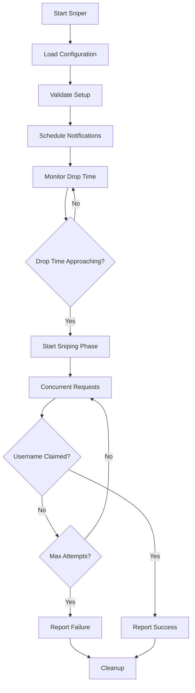

# How It Works

Understanding the internal mechanics of NameMC Sniper and the username sniping process.

## :gear: Overview

NameMC Sniper operates in three main phases:

1. **Monitoring Phase** - Schedules notifications and waits for drop time
2. **Sniping Phase** - High-speed claiming attempts
3. **Result Phase** - Reports outcome and cleanup



## :one: Monitoring Phase

### Initialization

When you start the sniper, it performs several initialization steps:

```python
# Simplified initialization process
def initialize_sniper():
    # 1. Load and validate configuration
    config = load_config("config.yaml")
    validate_config(config)
    
    # 2. Setup authentication
    bearer_token = config.get("bearer_token")
    validate_bearer_token(bearer_token)
    
    # 3. Initialize proxies
    if config.proxy.enabled:
        proxy_manager = ProxyManager(config.proxy.proxies)
        proxy_manager.test_all_proxies()
    
    # 4. Setup Discord notifications
    if config.discord.enabled:
        discord_client = DiscordClient(config.discord)
        discord_client.test_connection()
    
    # 5. Get username drop time
    drop_time = get_drop_time(config.target_username)
    
    return SnipeSession(config, drop_time)
```

### Notification Scheduling

The sniper schedules notifications at configured intervals:

```python
def schedule_notifications(drop_time, intervals):
    notifications = []
    
    for interval in intervals:
        notification_time = drop_time - timedelta(seconds=interval)
        
        if notification_time > datetime.now():
            notifications.append({
                'time': notification_time,
                'interval': interval,
                'message': format_countdown_message(interval)
            })
    
    # Sort by time
    notifications.sort(key=lambda x: x['time'])
    return notifications
```

### Drop Time Detection

The sniper determines when a username becomes available:

```python
def get_drop_time(username):
    # Query NameMC API for username information
    response = requests.get(f"https://api.namemc.com/profile/{username}")
    
    if response.status_code == 200:
        data = response.json()
        
        # Check if username is currently taken
        if data.get('status') == 'taken':
            # Calculate drop time (37 days after last name change)
            last_change = datetime.fromisoformat(data['name_history'][-1]['changed_at'])
            drop_time = last_change + timedelta(days=37)
            return drop_time
        else:
            # Username is already available
            return datetime.now()
    
    raise Exception(f"Could not determine drop time for {username}")
```

## :two: Sniping Phase

### Pre-Snipe Preparation

Before starting the actual sniping attempts:

```python
def prepare_sniping(config, drop_time):
    # Calculate when to start sniping
    start_time = drop_time - timedelta(seconds=config.start_sniping_at_seconds)
    
    # Wait until start time
    while datetime.now() < start_time:
        time.sleep(0.1)
    
    # Initialize request session
    session = requests.Session()
    session.headers.update({
        'Authorization': f'Bearer {config.bearer_token}',
        'Content-Type': 'application/json',
        'User-Agent': 'NameMC-Sniper/1.0'
    })
    
    return session
```

### Concurrent Request Strategy

The sniper uses multiple concurrent requests to maximize success chances:

```python
import asyncio
import aiohttp
from concurrent.futures import ThreadPoolExecutor

async def snipe_username(config, session_pool):
    username = config.target_username
    max_attempts = config.max_snipe_attempts
    concurrent_requests = config.concurrent_requests
    
    attempt_count = 0
    success = False
    
    # Create semaphore to limit concurrent requests
    semaphore = asyncio.Semaphore(concurrent_requests)
    
    while attempt_count < max_attempts and not success:
        # Create batch of concurrent requests
        tasks = []
        batch_size = min(concurrent_requests, max_attempts - attempt_count)
        
        for _ in range(batch_size):
            task = asyncio.create_task(
                make_snipe_request(semaphore, username, session_pool)
            )
            tasks.append(task)
        
        # Wait for any request to succeed
        done, pending = await asyncio.wait(
            tasks, 
            return_when=asyncio.FIRST_COMPLETED
        )
        
        # Cancel remaining requests if one succeeded
        for task in pending:
            task.cancel()
        
        # Check results
        for task in done:
            result = await task
            if result['success']:
                success = True
                break
        
        attempt_count += batch_size
        
        # Small delay between batches
        if not success:
            await asyncio.sleep(config.request_delay_ms / 1000)
    
    return success, attempt_count
```

### Individual Request Logic

Each sniping request follows this pattern:

```python
async def make_snipe_request(semaphore, username, session_pool):
    async with semaphore:
        try:
            # Get proxy from pool
            proxy = session_pool.get_proxy()
            
            # Prepare request payload
            payload = {
                'profileName': username
            }
            
            # Make the claim request
            async with aiohttp.ClientSession() as session:
                async with session.post(
                    'https://api.minecraftservices.com/minecraft/profile/name/{username}',
                    json=payload,
                    proxy=proxy.url,
                    timeout=aiohttp.ClientTimeout(total=5)
                ) as response:
                    
                    if response.status == 200:
                        # Success! Username claimed
                        return {
                            'success': True,
                            'status_code': 200,
                            'proxy': proxy.url,
                            'response_time': response.headers.get('response-time')
                        }
                    else:
                        # Request failed
                        return {
                            'success': False,
                            'status_code': response.status,
                            'proxy': proxy.url,
                            'error': await response.text()
                        }
                        
        except Exception as e:
            return {
                'success': False,
                'error': str(e),
                'proxy': proxy.url if 'proxy' in locals() else None
            }
```

### Proxy Rotation Logic

The proxy manager handles rotation and health checking:

```python
class ProxyManager:
    def __init__(self, proxy_list):
        self.proxies = [Proxy(url) for url in proxy_list]
        self.current_index = 0
        self.failed_proxies = set()
    
    def get_proxy(self):
        # Round-robin selection with health checking
        attempts = 0
        while attempts < len(self.proxies):
            proxy = self.proxies[self.current_index]
            self.current_index = (self.current_index + 1) % len(self.proxies)
            
            if proxy.url not in self.failed_proxies:
                return proxy
            
            attempts += 1
        
        # All proxies failed, reset and try again
        self.failed_proxies.clear()
        return self.proxies[0]
    
    def mark_proxy_failed(self, proxy_url):
        self.failed_proxies.add(proxy_url)
    
    def test_proxy_health(self, proxy):
        try:
            response = requests.get(
                'https://api.minecraft.net/status',
                proxies={'http': proxy.url, 'https': proxy.url},
                timeout=5
            )
            return response.status_code == 200
        except:
            return False
```

## :three: Result Phase

### Success Handling

When a username is successfully claimed:

```python
def handle_success(username, attempt_count, duration, proxy_used):
    # Log success
    logger.info(f"Successfully claimed username: {username}")
    logger.info(f"Attempts made: {attempt_count}")
    logger.info(f"Duration: {duration:.2f} seconds")
    logger.info(f"Proxy used: {proxy_used}")
    
    # Send Discord notification
    if discord_client:
        embed = create_success_embed(username, attempt_count, duration, proxy_used)
        discord_client.send_embed(embed)
    
    # Update statistics
    stats = {
        'username': username,
        'success': True,
        'attempts': attempt_count,
        'duration': duration,
        'proxy': proxy_used,
        'timestamp': datetime.now().isoformat()
    }
    
    save_statistics(stats)
```

### Failure Handling

When sniping fails:

```python
def handle_failure(username, attempt_count, duration, last_error):
    # Log failure
    logger.error(f"Failed to claim username: {username}")
    logger.error(f"Attempts made: {attempt_count}")
    logger.error(f"Duration: {duration:.2f} seconds")
    logger.error(f"Last error: {last_error}")
    
    # Send Discord notification
    if discord_client:
        embed = create_failure_embed(username, attempt_count, duration, last_error)
        discord_client.send_embed(embed)
    
    # Update statistics
    stats = {
        'username': username,
        'success': False,
        'attempts': attempt_count,
        'duration': duration,
        'error': last_error,
        'timestamp': datetime.now().isoformat()
    }
    
    save_statistics(stats)
```

## :zap: Performance Optimizations

### Request Timing

The sniper uses several techniques to minimize latency:

1. **Pre-established connections** - Keep HTTP connections alive
2. **DNS pre-resolution** - Resolve hostnames before sniping
3. **Optimal request timing** - Start requests just before drop time
4. **Concurrent execution** - Multiple simultaneous requests

### Memory Management

```python
# Efficient memory usage during sniping
class SnipeSession:
    def __init__(self, config):
        self.config = config
        # Pre-allocate request objects
        self.request_pool = [
            self.create_request_object() 
            for _ in range(config.concurrent_requests)
        ]
    
    def create_request_object(self):
        return {
            'session': requests.Session(),
            'headers': self.get_headers(),
            'payload': self.get_payload()
        }
```

### Network Optimization

```python
# Optimize network settings
def optimize_network_settings():
    # Increase socket buffer sizes
    socket.socket.setsockopt(socket.SOL_SOCKET, socket.SO_RCVBUF, 65536)
    socket.socket.setsockopt(socket.SOL_SOCKET, socket.SO_SNDBUF, 65536)
    
    # Disable Nagle's algorithm for lower latency
    socket.socket.setsockopt(socket.IPPROTO_TCP, socket.TCP_NODELAY, 1)
    
    # Set keep-alive options
    socket.socket.setsockopt(socket.SOL_SOCKET, socket.SO_KEEPALIVE, 1)
```

## :chart_with_upwards_trend: Monitoring and Analytics

### Real-time Metrics

The sniper tracks various metrics during operation:

```python
class SnipeMetrics:
    def __init__(self):
        self.start_time = time.time()
        self.requests_sent = 0
        self.responses_received = 0
        self.errors_encountered = 0
        self.proxy_switches = 0
        self.average_response_time = 0
    
    def update_response_time(self, response_time):
        self.responses_received += 1
        self.average_response_time = (
            (self.average_response_time * (self.responses_received - 1) + response_time) 
            / self.responses_received
        )
    
    def get_success_rate(self):
        if self.requests_sent == 0:
            return 0
        return (self.responses_received / self.requests_sent) * 100
```

### Performance Logging

```python
# Detailed performance logging
def log_performance_metrics(metrics):
    logger.info("=== Snipe Performance Metrics ===")
    logger.info(f"Duration: {time.time() - metrics.start_time:.2f}s")
    logger.info(f"Requests sent: {metrics.requests_sent}")
    logger.info(f"Responses received: {metrics.responses_received}")
    logger.info(f"Success rate: {metrics.get_success_rate():.1f}%")
    logger.info(f"Average response time: {metrics.average_response_time:.0f}ms")
    logger.info(f"Proxy switches: {metrics.proxy_switches}")
    logger.info(f"Errors: {metrics.errors_encountered}")
```

## :bulb: Technical Insights

### Why 30 Seconds Before Drop?

The default 30-second start time is optimized for:
- **Network latency** - Account for request travel time
- **Server processing** - Allow time for Minecraft servers to process
- **Competition** - Start before other snipers
- **Error recovery** - Time to retry failed requests

### Concurrent Request Strategy

Multiple concurrent requests increase success probability because:
- **Network redundancy** - Different routes to servers
- **Timing variations** - Slight timing differences
- **Proxy diversity** - Multiple IP addresses
- **Server load distribution** - Spread across server instances

### Bearer Token vs Credentials

Bearer tokens are preferred because:
- **Security** - No password exposure
- **Performance** - No authentication overhead per request
- **Reliability** - Less likely to trigger security measures
- **Compliance** - Better adherence to API best practices

## :arrow_right: Next Steps

- Learn performance optimization techniques in [Performance Optimization](performance.md)
- Troubleshoot common issues in [Troubleshooting](troubleshooting.md)
- Understand legal considerations in [Legal Notice](../legal/legal-notice.md)
