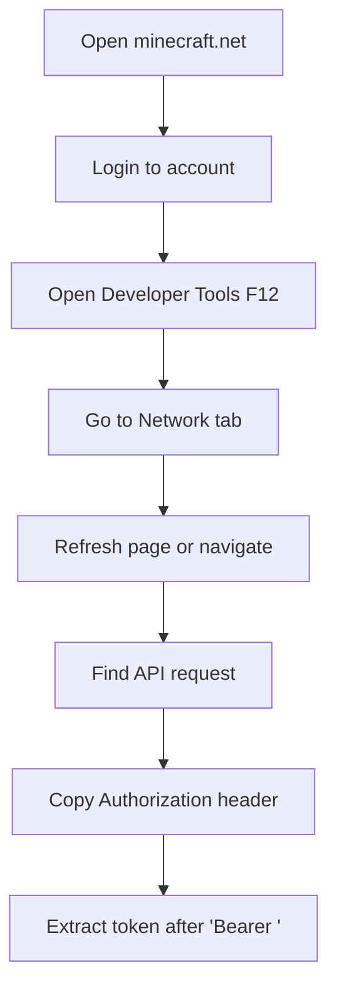

# Authentication

Learn how to obtain and use your Minecraft bearer token for secure authentication.

## :key: What is a Bearer Token?

A bearer token is a secure authentication method that doesn't require your email and password. It's a temporary access token that grants permission to perform actions on your behalf.

!!! info "Why Bearer Tokens?"
    - **More Secure**: No need to store credentials
    - **Temporary**: Tokens expire, limiting exposure
    - **Revocable**: Can be invalidated if compromised

## :computer: Method 1: Browser Developer Tools

This is the most straightforward method for getting your bearer token.

### Step-by-Step Guide

1. **Open your browser** and navigate to [minecraft.net](https://minecraft.net)

2. **Log in** to your Minecraft account

3. **Open Developer Tools**:
   - **Chrome/Edge**: Press `F12` or `Ctrl+Shift+I`
   - **Firefox**: Press `F12` or `Ctrl+Shift+I`
   - **Safari**: Press `Cmd+Option+I`

4. **Go to the Network tab** in Developer Tools

5. **Make a request** to any Minecraft service (refresh the page or navigate to profile)

6. **Find the Authorization header**:
   - Look for requests to `api.minecraftservices.com` or similar
   - Click on a request and look for the `Authorization` header
   - Copy the value after `Bearer ` (without the "Bearer " prefix)

### Visual Guide



## :gear: Method 2: Authentication Libraries

For more advanced users, you can use Python libraries to authenticate programmatically.

### Using minecraft-launcher-lib

```python
import minecraft_launcher_lib

# Authenticate with Microsoft account
login_url, state, code_verifier = minecraft_launcher_lib.microsoft_account.get_secure_login_data()
print(f"Please open this URL and login: {login_url}")

# After login, get the code from redirect URL
authorization_code = input("Enter the code from redirect URL: ")

# Get access token
login_data = minecraft_launcher_lib.microsoft_account.complete_login(
    authorization_code, 
    code_verifier, 
    state
)

# Extract bearer token
bearer_token = login_data['access_token']
print(f"Bearer Token: {bearer_token}")
```

### Installation

```bash
pip install minecraft-launcher-lib
```

## :shield: Security Best Practices

### Token Storage

**❌ Don't do this:**
```yaml
# config.yaml - DON'T hardcode tokens
snipe:
  bearer_token: "eyJ0eXAiOiJKV1QiLCJhbGciOiJSUzI1NiJ9..."
```

**✅ Do this instead:**
```yaml
# config.yaml - Use environment variables
snipe:
  bearer_token: "${MINECRAFT_BEARER_TOKEN}"
```

```bash
# Set environment variable
export MINECRAFT_BEARER_TOKEN="your_actual_token_here"
```

### Token Management

- **Rotate regularly**: Get new tokens periodically
- **Monitor expiration**: Tokens typically expire after 24 hours
- **Secure storage**: Use environment variables or secure vaults
- **Never share**: Keep tokens private and secure

## :clock: Token Expiration

Bearer tokens are temporary and will expire. Common expiration times:

- **Microsoft tokens**: 1 hour (with refresh capability)
- **Minecraft tokens**: 24 hours
- **Custom implementations**: Varies

### Handling Expiration

```python
# Check if token is still valid
def is_token_valid(token):
    headers = {"Authorization": f"Bearer {token}"}
    response = requests.get("https://api.minecraftservices.com/minecraft/profile", headers=headers)
    return response.status_code == 200

# Refresh token if needed
if not is_token_valid(current_token):
    current_token = get_new_token()
```

## :exclamation: Troubleshooting

### Common Issues

**"Invalid bearer token"**
- Token may have expired
- Check for extra spaces or characters
- Ensure you copied the complete token

**"Unauthorized access"**
- Verify the token is for the correct account
- Check if the account owns Minecraft
- Ensure proper permissions

**"Token not found in requests"**
- Clear browser cache and cookies
- Try a different browser
- Ensure you're logged into the correct account

### Validation

Test your token before using it:

```bash
# Test with curl
curl -H "Authorization: Bearer YOUR_TOKEN" \
     https://api.minecraftservices.com/minecraft/profile
```

Expected response:
```json
{
  "id": "uuid-here",
  "name": "YourMinecraftUsername"
}
```

## :warning: Important Notes

!!! danger "Account Security"
    - Never share your bearer token publicly
    - Revoke tokens if you suspect they're compromised
    - Use 2FA on your Microsoft/Minecraft account

!!! info "Legal Compliance"
    Ensure your use of bearer tokens complies with:
    - Minecraft Terms of Service
    - Microsoft Services Agreement
    - Applicable laws and regulations

## :arrow_right: Next Steps

With your bearer token ready, proceed to [Basic Usage](../usage/basic-usage.md) to start using NameMC Sniper.
